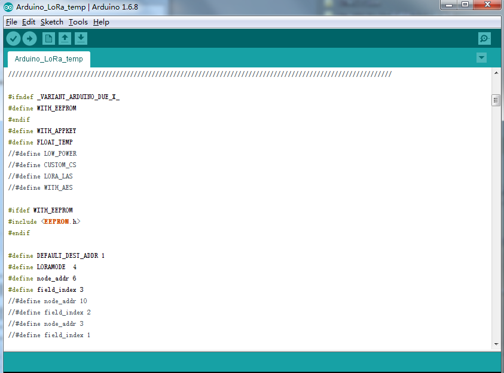

# A DIY low-cost LoRa gateway based on pcDuino
Thanks to this [open source project](http://cpham.perso.univ-pau.fr/LORA/RPIgateway.html) which uses the Raspberry Pi as Lora gateway and Arduino as Lora node device. We port this project to pcDuino and send the received data from Lora node to [LinkSpriteIO](www.linksprite.io). The basic architecture is shown as the following diagram.


There is an Arduino Lora node to read the sensor's data and send it to pcDuino Lora gateway. After pcDuino Lora gateway recevice the data and it will send it to LinkSpriteIO which is our IoT cloud.

The following content, I will introduce the details of how to DIY a low-cost Lora gateway with pcDuino and Arduino.

## Required
**pcDuino lora gateway**
- pcDuino8 Uno x 1
- [LoRa module](http://www.linksprite.com/wiki/index.php5?title=Low-cost_LoRa_Module) x 1
- Linker cable x 1
- Dupont Line x 2

**Arduino lora node**
- Arduino Uno x 1
- [LoRa module](http://www.linksprite.com/wiki/index.php5?title=Low-cost_LoRa_Module)x 1
- Linker cable x 4
- Dupont Line x 2

## Steps

### 1. Assemble the hardware
* According to the following pins map table to connect the lora module and pcDuino or Arduino

| Lora module pins | Arduino Pins | pcDuino Pins|
|:--------:|:--------:|:--------:|
|SCK|13|13|
|MISO|12|12|
|MOSI|11|11|
|NSS|10|10|
|VCC|3.3V|3.3V|
|GND|GND|GND|
#### Arduino Lora node


#### pcDuino Lora Gateway


### 2. Program Arduino Uno
- Download the Arduino program from [github](https://github.com/YaoQ/pcduino-lora-AP/tree/master/arduino-node)
- Use Arduino IDE to open the **Arduino_LoRa_node** project in examples folder
- Upload this program to Arduino Uno
- Open Serial Monitor to check the message



### 3. Program on the pcDuino8 Uno

#### Create device on LinkSpriteIO 
* Go to **www.linksprite.io** and sign up
* Enter your Email and password to create a new account
* Go to **My Account** to get your own **API Key**. 

 
* Click **My Device**, and choose **Create DIY Device**.
 

 
* Click the created device icon and get the **DeviceID** **.
 


#### Download the source code
* Access to the pcDuino8 Uno Ubuntu system
Note: user name and password are all: **linaro**:

```bash
git clone https://github.com/YaoQ/pcduino-lora-AP
cd pcDuino-lora-AP/pcduino-gateway
make
```
* Use your own deviceID and apikey to update the line 27 and 28 in LinkSpriteIO_Post.py
```python
 26 # Use your own deviceID and apikey
 27 deviceID="xxxxxxxxxx"
 28 apikey = "xxxxxxxxxxxxxxxxxxxxxxxxxxxxxxxxxxxx"
```

### 4. Test
To make it simple, we just use random number to simulate the temperature value and send it periodically to pcDuino lora gateway. Then pcDuino Lora gateway will post data to LinkSpriteIO.

```bash
./pcduino-gateway | python LinkSpriteIO_Post.py
```
On Arduino side:


On pcDuino side:


On LinkSpriteIO side:


